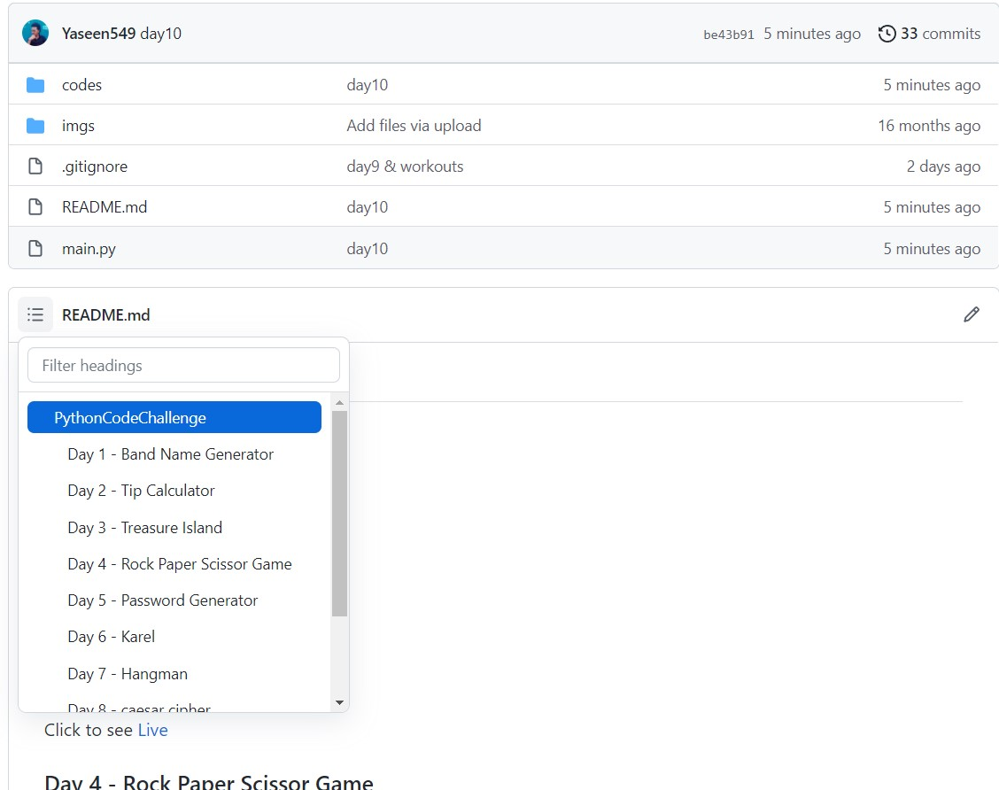

## PythonCodeChallenge

    <b> <i>100 Days of Code</i> </b>
    
Instruction for the code search

      

### Day 1 - Band Name Generator

Click to see <a href="https://replit.com/@Yaseen59/band-name-generator-start#main.py">Live</a>

### Day 2 - Tip Calculator

Click to see <a href="https://replit.com/@Yaseen59/tip-calculator-start#main.py">Live</a>

### Day 3 - Treasure Island

Click to see <a href="https://replit.com/@Yaseen59/treasure-island-start#main.py">Live</a>

### Day 4 - Rock Paper Scissor Game

Click to see <a href="https://replit.com/@Yaseen59/rock-paper-scissors-start#main.py">Live</a>

### Day 5 - Password Generator

Click to see <a href="https://replit.com/@Yaseen59/password-generator-start#main.py">Live</a>

### Day 6 - Karel
No Preview

### Day 7 - Hangman

Click to see <a href="https://replit.com/@Yaseen59/Day-7-Hangman-5-Start#main.py">Live</a>

### Day 8 - caesar cipher

Click to see <a href="https://replit.com/@Yaseen59/caesar-cipher-4-start#main.py">Live</a>

### Day 9 - blind Auction

Click to see <a href="https://replit.com/@Yaseen59/blind-auction-start#main.py">Live</a>

### Day 10 - Calculator using Dictionaries & functions

Click to see <a href="https://replit.com/@Yaseen59/calculator-start#main.py">Live</a>

